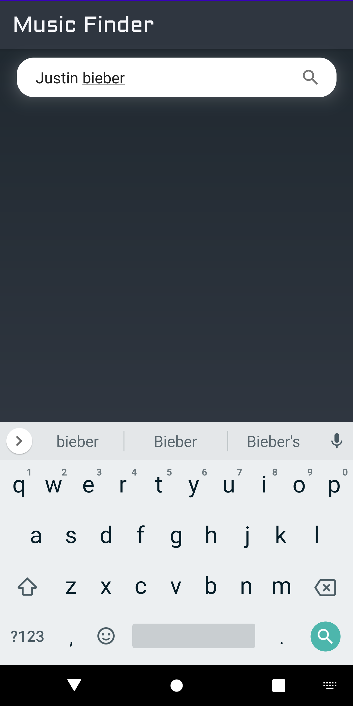

# Music-Finder
### Music finder is an Android app that connects to the iTunes connect API to retrieve songs for an Artist. 
### The iTunes API to connect to is https://itunes.apple.com/search?term=#searchTerm

### The App has following features/code_attributes :
<ul>
  <li> Uses <i><b>Room for local database storage</b></i> so app can function with previous data while there is no internet </li>
  <li> Uses <i><b>Retrofit for networking</b></i> </li>
  <li> Uses <i><b>MVVM android Architecture</b></i> for code structuring </li>
  <li> Built using <i><b>Kotlin</b></i> and used <i><b>coroutines</b></i> for background operations. </li>
  <li> A search box that allows the user to search for an artist. This term is passed to the iTunes API in place of the #searchTerm parameter </li>
  <li> A grid that shows the results </li>
</ul>
 
  

  
